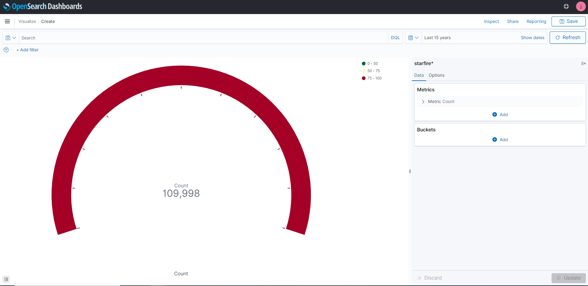
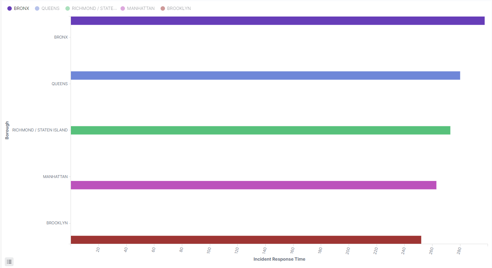
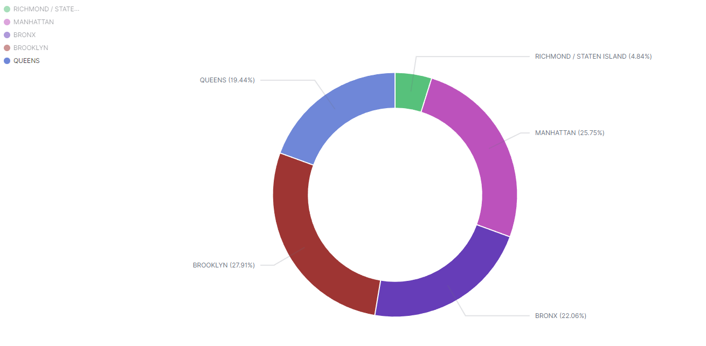
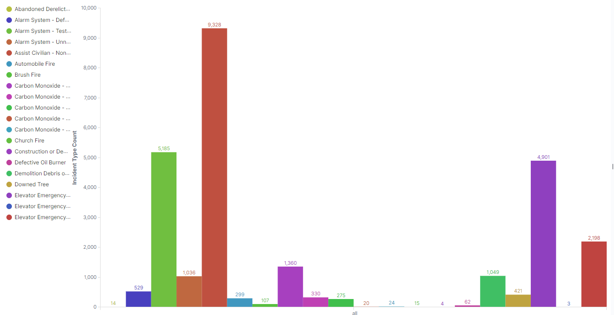
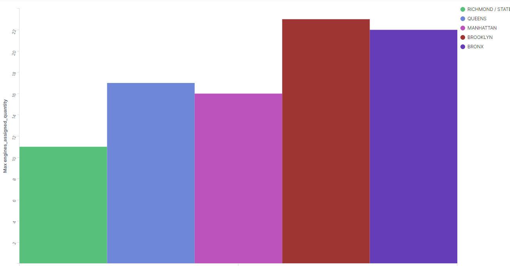

### CIS 9760 Project 1 - James Mancuso
<p>For this project I used EC2, terminal, Docker, and ElasticSearch to ingest and analyze a dataset that is typically too large to fit into a single machine. We will use the EC2 instance to create the project folder (including: python script, Dockerfile, requirements.txt) to stream the data into ElasticSearch. The streaming is done by building and creating a docker image that runs the scripts below to stream the data.</p>

<p>The python script will utilize the Socrata Open Data API to extract data from NYC Open Data. Following the extraction, I will load the data into an Elasticsearch (OpenSearch) instance, and visualize/analyze with OpenSearch dashboards.</p>

#### Creating and Building Docker Image
<p>After defining my requirements.txt by adding my dependencies and creating a Dockerfile, I was able to build the Docker image with the following Command:
</p>

```
docker build -t bigdataproject1:1.0 .
```

### Running the docker Image
<p>To the run the docker image we needed a few different environental variables from the verious </p>

```
docker run \

-e DATASET_ID="*********" \

-e APP_TOKEN="*************" \

-e ES_HOST="https://search-project-elastic-b5pqywiil2vzehe4d2egrxnkjq.us-east-1.es.amazonaws.com" \

-e ES_USERNAME="jamesmancuso" \

-e ES_PASSWORD="*************" \

-e INDEX_NAME="starfire" \

bigdataproject1:1.0 --page_size=10000 --num_pages= 10
```

### Gauge Chart 



### Analysis

<p>After streaming the data into Opensearch, I performed some analysis on the dataset and created 4 visuals:</p>

#### Visual #01



<p>Visual #1 represents the average incident response time based on the boroughs. Based on the data we can see the Bronx has the longest time it takes for incidents at around 298 seconds with Brooklyn having the fastest response time at 252 seconds.</p>

#### Visual #02



<p>Visual #2 represents the Total number of engines assigned per borough. The data highlights that Brooklyn and Manhattan are the top 2 boroughs in engines assigned with 27.91% and 25.75% respectively. This is interesting because Manhattan has both a smaller land area and population compared to Queens and yet it required more engines. Queens had a 19.44% of total engines assigned to them, the Bronx had 22.06% and Staten Island had 4.84%.</p>


#### Visual #03



<p>Visual #3 represents the top 5 incident classification that were responded to. The data highlights the most common incident that was responded to was to "assist civilian non-medical" way with 9,328 responses.Next being an "alarm system (testing purposes)" at 5,185, "elevator emergency (occupied)", "elevator (unoccupied)" at 2,198, and "carbon monoxide - code 1 - Invesigation" at 1,360.</p>

#### Visual #04



<p>Visual #4 represent the maximum engines that were assigned to each borough. From the chart, we can see Brooklyn had the max engine assigned at 23, the Bronx had the second largest at 22, Queens the third largest at 17, Manhattan the fourth largest at 16, and Staten Island the lowest at 11.</p>
